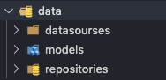
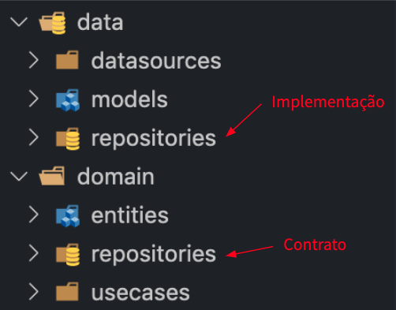
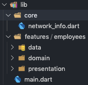
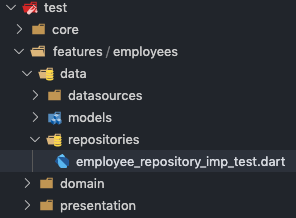

# Clean Architecture - Data Layer Testes e Implementação

## Introdução
Este projeto é um tutorial sobre testes na Data Layer da Clean Architecture. Neste tutorial iremos implementar o `EmployeeRepositoryI.dart` que é uma interface da Domain Layer.


## Um pouco de Clean Architecture

Na camada de dados, Data Layer, temos os diretórios **datasources**, **repositories** e **models**, como mostrado na Figura 1. 



## Datasources

No datasourses temos as classes responsáveis por acessar os dados diretamente por exemplo, buscar dados local, usando SharedPreferences, SQFlite, Hive, etc ou remoto, usando Http, Dio, Retrofit.

## Models

No models é onde está a representação das classes de dados. Exemplo, usuário, funcionário, item de uma lista de compra, etc. Geralmente, é nos models que se coloca os métodos fromJson e toJson do caso do Dart. Os models herdam suas propriedades da **Entities** da Domain Layer.

## Repositories

Este diretório é cérebro do Data Layer, é aqui deve ser feito as regras responsáveis para acessar os dados. Lembre-se sempre, regras de acesso aos dados e não regras de negócio. É o repositories que fornece os dados para as outras camadas. É por meio de repositories que a Domain Layer tem acesso aos dados. Na Domain Layer também há um diretório chamado repositories, mas lá são apenas as interfaces, contratos, ou seja, o repositories da Domain Layer definem os métodos que serão implementados na camada no repositories do Data Layer, como mostrado na Figura 2.




Neste artigo vamos focar nossas forças no repositories do Data Layer, ou seja, na implementação das interfaces que foram definidas no Domain Layer.

## Interfaces e Entidades da Domain Layer

Neste exemplo vamos implementar o método **getAllEmployees** que foi definido na interface EmployeeRepositoryI da Domain Layer. Segue as classes da Domain Layer.

-> domain/repositories/employee_repository_i.dart
```dart
import '../entities/employee.dart';

abstract class EmployeeRepositoryI {
  Stream<List<Employee>> getAllEmployees();
}
```
-> domain/entities/employee.dart
```dart
import 'package:meta/meta.dart';
import 'package:equatable/equatable.dart';

class Employee extends Equatable {
  final int id;
  final String name;
  final double salary;
  final int age;

  Employee({
    @required this.id,
    @required this.name,
    @required this.salary,
    this.age
  });

  @override
  List<Object> get props => [id, name, salary, age];
}
```

## Implementação da Data Layer

Primeiro vamos implementar o Model da Data Layer. Onde EmployeeModel herda da entity Employee da Domain Layer. Já a EmployeeModel está na pasta ``models`` da Data Layer, como segue:

#### EmployeeModel

-> data/models/employee_model.dart
```dart
import 'package:meta/meta.dart';

import '../../domain/entities/employee.dart';

class EmployeeModel extends Employee {
  final int id;
  final String name;
  final double salary;
  final int age;

  EmployeeModel({
    @required this.id,
    @required this.name,
    @required this.salary,
    this.age
  }) : super(
    id: id,
    name: name,
    salary: salary,
    age: age
  );

  factory EmployeeModel.fromJson(Map<String, dynamic> mapJson) {
    return EmployeeModel(
      id: mapJson['id'],
      name: mapJson['name'],
      salary: mapJson['salary'],
      age: mapJson['age'],
    );
  }

  Map<String, dynamic> toJson() {
    return {
      'id': this.id,
      'name': this.name,
      'salary': this.salary,
      'age': this.age,
    };
  }
}
```
Além de herdar as propriedades da entity **Employee**, o **EmployeeModel** adiciona dois comportamentos úteis para o armazenamento e recuperação dos dados **toJson** e **fromJson**, respectivamente.


#### EmployeeRepositoryImp

Vamos agora à implementação da interface EmployeeRepositoryI, que será chamada de EmployeeRepositoryImp, a implementação deve ficar na Data Layer no diretório repositories, como segue:

-> data/repositories/employee_repository_imp.dart
```dart
import 'package:meta/meta.dart';

import '../../../../core/network_info.dart';
import '../../domain/repositories/employee_repository_i.dart';
import '../datasourses/employee_local_datasource.dart';
import '../datasourses/employee_remote_datasource.dart';
import '../models/employee_model.dart';

class EmployeeRepositoryImp implements EmployeeRepositoryI {

  final NetworkInfoI networkInfo;
  final EmployeeLocalDataSourceI localDataSource;
  final EmployeeRemoteDataSourceI remoteDataSource;

  EmployeeRepositoryImp({
    @required this.networkInfo,
    @required this.localDataSource,
    @required this.remoteDataSource
  });

  @override
  Stream<List<EmployeeModel>> getAllEmployees() async* {
    final localEmployees = await localDataSource.getAllEmployees();

    if (localEmployees != null) yield localEmployees;

    if (await networkInfo.isConnected) {
      final remoteEmployees = await remoteDataSource.getAllEmployees();
      if (remoteEmployees != null) yield remoteEmployees;
    }
  }
}
```
Observe que o ```EmployeeRepositoryImp``` herda o comportamente de ```EmployeeRepositoryI``` e depende de três interfaces no seu construtor, ```NetworkInfoI```, ```EmployeeLocalDataSourceI```, ```EmployeeRemoteDataSourceI```. Essa é a parte interessante de depender apenas de interfaces e não de implementação. Pois dessa forma, nós podemos testar a classe acima sem dependemos da plataforma no qual estamos desenvolvendo. Ou seja, a classe **EmployeeRepositoryImp** funcionará da mesma forma tanto no Flutter Mobile, Web e também no nosso ambiente de testes. A única interface que não pertence a feature employee é a NetworkInfoI, pois ela faz parte de um contexto geral da aplicação. Por isso, ela está localizada na pasta ```core```, na raiz do projeto.




## Testes do Data Layer

Com a implementação do nosso repository da forma adequada, agora podemos testar o seu comportamento em situações diferentes. O nosso ambiente de testes terá a estrutura das pastas semelhante ao do projeto, como segue:



A ferramenta de teste utilizada para mockar as interfaces será o ```mockito```, que neste momento está na versão ```4.1.1```. Primeiramente, vamos mockar todas as interfaces no qual o employee_repository_imp depende e instanciar nossa classe .

#### Mocks
```dart
import 'package:mockito/mockito.dart';
import 'package:flutter_test/flutter_test.dart';
import 'package:tdd_clean_arch_articles/core/network_info.dart';
import 'package:tdd_clean_arch_articles/features/employees/data/models/employee_model.dart';
import 'package:tdd_clean_arch_articles/features/employees/data/datasourses/employee_local_datasource.dart';
import 'package:tdd_clean_arch_articles/features/employees/data/datasourses/employee_remote_datasource.dart';
import 'package:tdd_clean_arch_articles/features/employees/data/repositories/employee_repository_imp.dart';

class NetworkInfoMock extends Mock implements NetworkInfoI {}
class EmployeeLocalDataSourceMock extends Mock implements EmployeeLocalDataSourceI {}
class EmployeeRemoteDataSourceMock extends Mock implements EmployeeRemoteDataSourceI {}

void main() {
  EmployeeRepositoryImp repository;
  NetworkInfoMock networkInfo;
  EmployeeLocalDataSourceMock localDataSource;
  EmployeeRemoteDataSourceMock remoteDataSource;

  setUp(() {
    networkInfo = NetworkInfoMock();
    localDataSource = EmployeeLocalDataSourceMock();
    remoteDataSource = EmployeeRemoteDataSourceMock();

    repository = EmployeeRepositoryImp(
      networkInfo: networkInfo,
      localDataSource: localDataSource,
      remoteDataSource: remoteDataSource
    );
  });

  ...

}
```

#### Primeiro teste
Logo após o setUp do nosso ambiente, vamos implementar nosso primeiro teste.

```dart
test('-> sem cache e com conexão', () async {
  // arranges
  when(networkInfo.isConnected).thenAnswer((_) async => true);
  when(localDataSource.getAllEmployees()).thenAnswer((_) async => null);
  when(remoteDataSource.getAllEmployees())
    .thenAnswer((_) async => <EmployeeModel>[
      EmployeeModel(id: 1, name: 'João das Neves', salary: 1500.0, age: 24),
      EmployeeModel(id: 2, name: 'Maria das Neves', salary: 900.0, age: 22),
    ]);

  final expectedResult = emitsInOrder([
    <EmployeeModel>[
      EmployeeModel(id: 1, name: 'João das Neves', salary: 1500.0, age: 24),
      EmployeeModel(id: 2, name: 'Maria das Neves', salary: 900.0, age: 22),
    ],
    emitsDone
  ]);

  // acts
  final stream = repository.getAllEmployees();

  //asserts
  await expectLater(stream, expectedResult);
  verify(networkInfo.isConnected);
  verify(localDataSource.getAllEmployees());
  verify(remoteDataSource.getAllEmployees());
  verifyNoMoreInteractions(networkInfo);
  verifyNoMoreInteractions(localDataSource);
  verifyNoMoreInteractions(remoteDataSource);
});
```

Para entender melhor os testes, segue algumas explicações.

##### when(...).thenAnswer()
Método ```when``` é utilizado com interfaces mockadas pelo Mockito. Ele gera uma resposta fake quando o método passado á chamado. É dessa forma que podemos testar interfaces sem a necessidade de implementá-las. Por isso, utilizamos ele com todos os mocks feitos a partir da interfaces.

##### final stream = repository.getAllEmployees();
Logo após fizemos a chamada do método ```getAllEmployees``` que retorna uma Stream. Esse métodos que vai utilizar os mocks que criamos das interfaces acima e passamos nos contrutor da classe ```EmployeeRepositoryImp``` lá no setUp.

##### Stream asserts
Temos as verificações dos valores emitidos pela ```stream``` retornada pelo método ```getAllEmployees```. Para verificar esses valores utilizamos o ```expectLater``` e o ```emitInOrder```. A sequência emitida pela ```stream``` deverá ser apenas uma lista de EmployeeModel e logo após ser fechada. Pois nesse teste não teremos dados no cache.

##### Verifies asserts
Por fim, após o ```expectLater``` temos a verificação do comportamento do método ```getAllEmployees```. É nessa parte que verificamos quais métodos foram chamados e quantas vezes cada método foi requisitado classe ```EmployeeRepositoryImp```.

##### verify
O método ```verify```` assegura que houve uma chamada no métodos passado como parâmetro.

##### verifyNoMoreInteractions
O método ```verifyNoMoreInteractions``` verifica se houve mais de uma interação na classe mockada.

## Referências

- [TDD](https://resocoder.com/flutter-clean-architecture-tdd/)
- [Mockito](https://pub.dev/documentation/mockito/latest/mockito/mockito-library.html)
- [Writing test](https://pub.dev/packages/test)
- [emitInOrder](https://pub.dev/documentation/test_api/latest/test_api/emitsInOrder.html)
